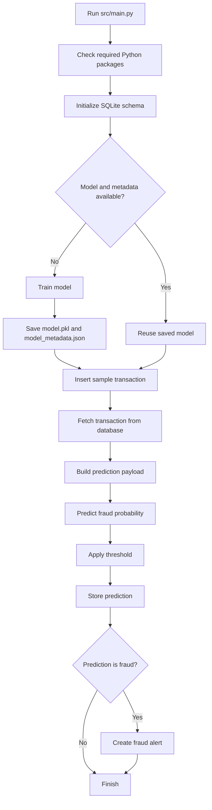
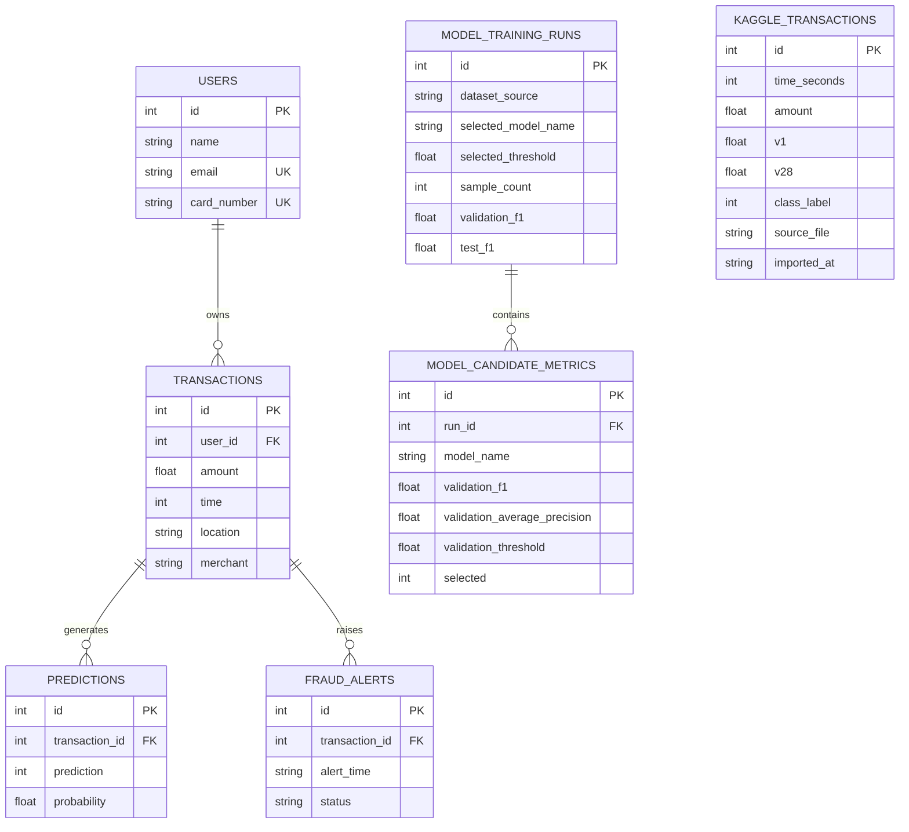
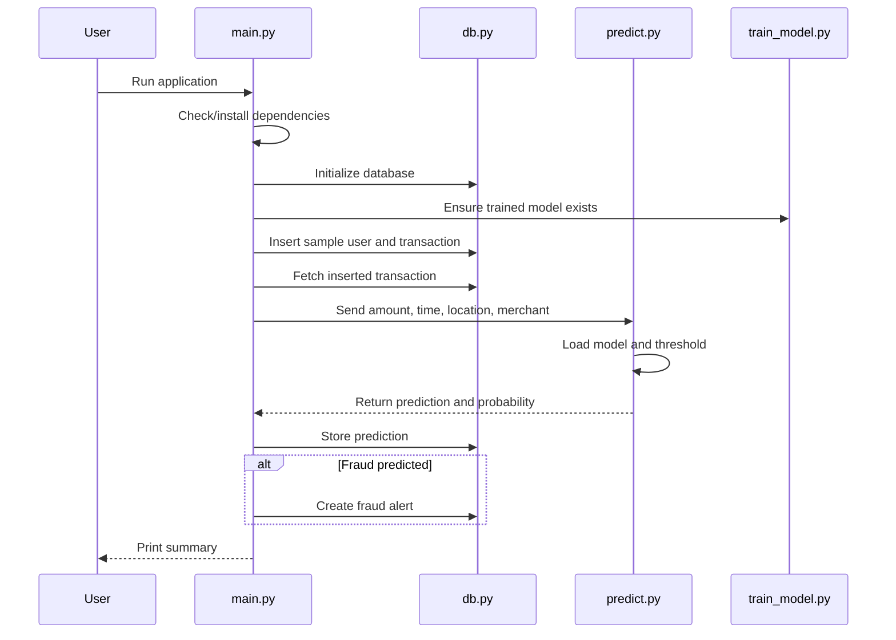

# Current System Deep Dive

## 1. Purpose of This Document

This file explains the current repository as it actually exists today. It is written for three kinds of explanation:

1. Database discussion for the DBS instructor
2. Model and training discussion for the AI instructor
3. End-to-end system and design discussion for the SDA instructor

This is not just a summary of the idea. It is a deep dive into the current code, tables, execution flow, patterns, strengths, and limitations.

## 2. One-Line Summary

The current project is a Python + SQLite fraud detection demo that:

- initializes a relational database,
- trains or reuses a saved machine learning model,
- inserts a sample transaction,
- fetches that transaction from the database,
- predicts whether it is fraud,
- stores the prediction,
- creates an alert if fraud is detected.

## 3. Repository Reality Check

The repository is small and focused. Its real structure is:

```text
database/
  schema.sql
model/
  train_model.py
  model.pkl
  model_metadata.json
src/
  db.py
  download_dataset.py
  import_kaggle_to_db.py
  insert_data.py
  main.py
  predict.py
data/
  fraud_detection.db
README.md
SYSTEM_WORKING.md
report.md
next-phase-implementation-plan.md
```

## 4. Verified Current State

I checked the code and the local SQLite database before writing this document.

Current verified state:

- Database file exists at `data/fraud_detection.db`
- Trained model exists at `model/model.pkl`
- Metadata exists at `model/model_metadata.json`
- Latest saved model metadata says:
  - dataset source: `synthetic:generated`
  - selected model: `logistic_regression`
  - selection metric: `validation_average_precision`
  - selected threshold: about `0.6763`
- `kaggle_transactions` currently has `0` rows
- Runtime tables currently contain demo records generated by running the app

Verified table counts after runtime check:

- `users`: 1
- `transactions`: 2
- `predictions`: 2
- `fraud_alerts`: 2
- `kaggle_transactions`: 0
- `model_training_runs`: 1
- `model_candidate_metrics`: 3

Important conclusion:

The project already supports a database-first Kaggle import path in code, but the current local database has not been populated with Kaggle rows yet. So the latest trained model was built from synthetic fallback data, not real Kaggle data.

## 5. What the System Does Today

### 5.1 In simple words

If a non-technical person asks what this project does, the answer is:

> This system saves transaction records in a database, uses a trained fraud detection model to judge whether a transaction looks suspicious, saves that prediction, and raises an alert when the transaction appears fraudulent.

### 5.2 In technical words

The system combines:

- a SQLite relational database,
- a scikit-learn classification pipeline,
- a small orchestration script,
- supporting ingestion and prediction utilities.

It is a backend workflow project, not a UI project.

## 6. Current Architecture

### 6.1 Main design style

The code follows a simple layered pattern:

- `src/main.py`: orchestration layer
- `src/db.py`: persistence layer
- `model/train_model.py`: training and model selection layer
- `src/predict.py`: inference layer
- `src/insert_data.py`: demo data creation
- `src/download_dataset.py` and `src/import_kaggle_to_db.py`: dataset ingestion support

### 6.2 High-level flow



## 7. File-by-File Deep Dive

## 7.1 `src/main.py`

This is the system entrypoint and coordinator.

Responsibilities:

- checks whether required packages are installed,
- installs requirements if packages are missing,
- initializes the database,
- ensures a trained model is available,
- inserts a demo transaction,
- fetches it back from the database,
- calls prediction logic,
- stores the result,
- creates an alert when fraud is predicted,
- prints a simple run summary.

Key pattern:

`main.py` does not contain ML logic or SQL logic directly. It delegates work to other modules. That is good separation of concerns.

Important detail:

It uses lazy imports through `_load_runtime_modules()`. This avoids import failures before dependency installation happens.

## 7.2 `src/db.py`

This is the database helper module.

Responsibilities:

- open SQLite connections,
- enable foreign keys,
- initialize schema from `database/schema.sql`,
- insert and fetch operational data,
- insert model training history,
- insert imported Kaggle rows.

Key pattern:

This file behaves like a lightweight repository/data-access layer. SQL is centralized instead of scattered across all files.

Important database patterns:

- `get_connection()` is a context manager
- every connection commits automatically on successful exit
- `PRAGMA foreign_keys = ON` is enabled per connection
- insert functions are kept small and purpose-specific

## 7.3 `src/insert_data.py`

This module inserts one deterministic sample transaction.

Current demo user:

- name: `Ayesha Khan`
- email: `ayesha.khan@example.com`
- card number: `4111111111111111`

Current demo transaction:

- amount: `12450.75`
- time: `23`
- location: `Lahore`
- merchant: `electronics_store`

Why this matters:

The end-to-end workflow is reproducible. Every run uses the same user profile and same transaction pattern.

## 7.4 `src/predict.py`

This is the inference layer.

Responsibilities:

- load saved model from `model/model.pkl`
- load metadata from `model/model_metadata.json`
- use metadata threshold if available
- convert probability into final class

Key pattern:

Inference is separated from training. This is important because prediction logic can reuse the stored model without retraining.

## 7.5 `model/train_model.py`

This is the most important module on the AI side.

Responsibilities:

- load dataset from the best available source,
- create fallback synthetic data if needed,
- preprocess numeric and categorical features,
- compare candidate models,
- tune the decision threshold,
- check overfitting and underfitting,
- retrain the selected model on train + validation data,
- evaluate on the test set,
- save model artifact and metadata,
- log training run into database tables when possible.

Key pattern:

This file is not just "train one model and save it". It contains a miniature model selection pipeline.

## 7.6 `src/import_kaggle_to_db.py`

This module imports `creditcard.csv` into the `kaggle_transactions` table.

Responsibilities:

- validate the CSV header,
- read the file in chunks,
- convert rows into database tuples,
- insert in batches,
- optionally clear old rows unless `--append` is used,
- print import summaries.

Why this matters:

This is the bridge between external raw data and the database.

## 7.7 `src/download_dataset.py`

This script downloads the Kaggle fraud dataset using `kagglehub` and copies `creditcard.csv` to:

`data/raw/creditcardfraud/creditcard.csv`

This is a convenience utility for setup, not part of runtime prediction flow.

## 8. Database Design Deep Dive

## 8.1 Core operational tables

### `users`

Purpose:

- stores cardholder identity

Columns:

- `id` as primary key
- `name`
- `email` with unique constraint
- `card_number` with unique constraint

### `transactions`

Purpose:

- stores each transaction that will be evaluated

Columns:

- `id` as primary key
- `user_id` as foreign key to `users.id`
- `amount`
- `time`
- `location`
- `merchant`

### `predictions`

Purpose:

- stores AI output for a transaction

Columns:

- `id` as primary key
- `transaction_id` as foreign key to `transactions.id`
- `prediction`
- `probability`

### `fraud_alerts`

Purpose:

- stores alert records for suspicious transactions

Columns:

- `id` as primary key
- `transaction_id` as foreign key to `transactions.id`
- `alert_time`
- `status`

## 8.2 Training and audit tables

### `kaggle_transactions`

Purpose:

- stores imported real training rows from the Kaggle credit card dataset

Columns:

- `id`
- `time_seconds`
- `amount`
- `v1` to `v28`
- `class_label`
- `source_file`
- `imported_at`

This is a staging/training table. It is not used directly by the runtime transaction screen or runtime transaction payload.

### `model_training_runs`

Purpose:

- stores one row per model training session

Examples of stored data:

- dataset source
- selected model
- selected threshold
- sample counts
- train, validation, test F1
- average precision metrics
- overfit and underfit flags
- run timestamps

### `model_candidate_metrics`

Purpose:

- stores evaluation details for every candidate model considered in a training run

This is a model comparison history table and gives the project stronger auditability.

## 8.3 Entity relationship view



## 8.4 Constraints and integrity rules

The schema contains useful academic features:

- primary keys on all main tables
- foreign keys between parent and child records
- `ON DELETE CASCADE` on dependent tables
- check constraints on:
  - `amount >= 0`
  - `time BETWEEN 0 AND 23`
  - `prediction IN (0, 1)`
  - `probability BETWEEN 0 AND 1`
  - `status` limited to allowed alert states
  - Kaggle class label limited to `0` or `1`
- unique constraints on `users.email` and `users.card_number`

## 8.5 Indexes

The schema adds indexes for:

- `transactions.user_id`
- `predictions.transaction_id`
- `fraud_alerts.transaction_id`
- `kaggle_transactions.class_label`
- `kaggle_transactions.source_file`
- `model_training_runs.dataset_source`
- `model_training_runs.selected_model_name`
- `model_candidate_metrics.run_id`
- `model_candidate_metrics.selected`

This shows awareness of query performance even in a small academic project.

## 8.6 Normalization analysis

### What is normalized well

The operational transaction flow is partially normalized:

- user data is separated from transactions
- prediction data is separated from transactions
- alerts are separated from predictions and transactions
- training run summary is separated from candidate-level metrics

This reduces duplication and improves traceability.

### What is still not fully normalized

The system is not fully normalized in some areas:

- `location` is stored as free text inside `transactions`
- `merchant` is stored as free text inside `transactions`
- Kaggle feature columns `v1` to `v28` are wide and denormalized by design

### Normalization verdict

For viva discussion, a fair answer is:

> The operational transaction schema is mostly in 3NF for the current scope because user identity is separated from transaction facts, and predictions and alerts are kept in their own dependent tables. However, merchant and location are still text attributes and could be further normalized into lookup tables if the project grows.

### Practical improvement path

To make the database story stronger later:

- create `locations` table
- create `merchants` table
- reference them through foreign keys from `transactions`
- optionally add `cards` and `accounts` tables if you want a more banking-style schema

## 9. AI Pipeline Deep Dive

## 9.1 Current training features

The final model is trained on four project-level features:

- `amount`
- `time`
- `location`
- `merchant`

Target label:

- `fraud`

This is important: the runtime model does not consume all Kaggle `V1..V28` columns directly. Instead, the code maps Kaggle data into the smaller project schema.

## 9.2 Dataset source priority

The training script uses this exact fallback order:

1. `kaggle_transactions` from SQLite
2. `data/fraud_transactions.csv`
3. generated synthetic dataset

Current actual local result:

Because the database has zero Kaggle rows and no fallback CSV is present, the latest saved model was trained on synthetic data.

## 9.3 Synthetic dataset generation

When real data is unavailable, the code generates a dataset using:

- gamma-distributed amounts
- random hour of day
- random location category
- random merchant category
- a rule-based fraud score with added noise

This keeps the project runnable, but it is only a fallback strategy.

## 9.4 Kaggle-to-project schema mapping

The code uses a handcrafted mapping:

- `amount` comes from Kaggle `Amount`
- `time` becomes hour-of-day from `time_seconds`
- `location` is derived from `v1`, `v2`, `v3`
- `merchant` is derived from `v4`, `v5`
- `fraud` comes from `class_label`

Important academic point:

This mapping is artificial. It is not a true real-world semantic mapping from anonymized PCA features to merchant or location. It exists so the current demo can keep the same simple runtime schema while still supporting Kaggle-based training.

That is acceptable for a semester project if you explain it honestly.

## 9.5 Preprocessing pipeline

Numeric features:

- `amount`
- `time`

Numeric processing:

- median imputation
- standard scaling

Categorical features:

- `location`
- `merchant`

Categorical processing:

- most-frequent imputation
- one-hot encoding

This is built using `ColumnTransformer` and `Pipeline`, which is a correct scikit-learn pattern.

## 9.6 Candidate models

The current code compares exactly three models:

- Logistic Regression
- Random Forest
- Extra Trees

This is more advanced than the original single-model plan, but still smaller than your future idea of choosing 3 out of 10 candidates.

## 9.7 Split strategy

The current split design is:

- 80% train+validation, 20% test
- then 75% / 25% split inside train+validation

So the effective final ratio is:

- 60% train
- 20% validation
- 20% test

This is a valid academic split because:

- training learns the model,
- validation selects model and threshold,
- test evaluates the final selected model on unseen data.

## 9.8 Threshold tuning

The code does not hardcode a threshold of 0.5.

Instead it:

- computes precision-recall curve on validation probabilities
- calculates F1 for each candidate threshold
- picks the threshold with the best validation F1

This is a strong design choice for fraud detection because fraud datasets are usually imbalanced.

## 9.9 Model selection logic

The best candidate is selected by this priority:

1. highest validation average precision
2. then highest validation F1
3. then highest validation recall

This is defensible because average precision is useful for imbalanced classification.

## 9.10 Overfit and underfit checks

The code flags overfit if:

- train F1 minus validation F1 is too large, or
- train average precision is much higher than validation average precision

The code flags underfit if:

- validation F1 is low and validation average precision is also low

This is a heuristic quality check, not a formal theorem, but it is academically useful.

## 9.11 Persistence and audit trail

The training layer saves:

- model artifact in `model/model.pkl`
- metadata in `model/model_metadata.json`
- run summary in `model_training_runs`
- candidate details in `model_candidate_metrics`

This is one of the strongest parts of the current project.

## 10. Runtime Transaction Flow

## 10.1 Actual sequence



## 10.2 Why the fetch-after-insert step matters

The code inserts a transaction and then fetches it back before prediction.

This is useful for explanation because it demonstrates:

- the row is physically stored in the database,
- the application can retrieve persisted data,
- the model input is built from stored records instead of only in-memory variables.

## 11. Software Engineering and SDA View

## 11.1 Architectural patterns present today

The current codebase shows these patterns:

- orchestration pattern in `main.py`
- separation of concerns across training, prediction, and persistence
- configuration-by-path constants
- fallback chain for data source reliability
- metadata-driven inference threshold
- audit logging through registry tables
- small reusable helper functions instead of one large script

## 11.2 What the SDA instructor can appreciate

From a software design perspective, the project already demonstrates:

- modular file structure
- layered responsibilities
- reproducible workflow
- persistent system state
- coupling between AI layer and DB layer
- error-handled CLI utilities
- traceability of model training decisions

## 11.3 What is still missing for a stronger SDA presentation

The current repository does not yet include:

- frontend or dashboard
- explicit service layer classes
- API layer
- formal UML documentation files
- role-based user interactions
- configurable logging framework
- testing suite

## 12. Patterns, Strengths, and Weaknesses

## 12.1 Strong patterns in the current project

- Single entrypoint for end-to-end execution
- Clear database schema ownership in one SQL file
- Good use of scikit-learn pipelines
- Model threshold stored separately from raw model artifact
- Model run history saved into database
- Data-source fallback design keeps the project runnable

## 12.2 Current limitations

- No UI yet
- Runtime transaction is a hardcoded demo transaction
- Current local training state is synthetic, not real Kaggle-based
- Only 3 candidate models are compared, not 10
- No automatic data understanding/reporting for uploaded datasets
- No database explanation engine for normalization, PK/FK, or schema reasoning
- No diagram generation inside the application
- No tests

## 12.3 Important academic honesty point

For your presentation, do not claim that the current system already performs intelligent auto-understanding of arbitrary datasets or automatic top-3 model recommendation from a large model pool. That is the next major version, not the current version.

## 13. What Each Instructor Can Be Told Today

## 13.1 For the Database instructor

You can say:

> The system uses a relational SQLite database with normalized operational tables for users, transactions, predictions, and fraud alerts. Foreign keys enforce data relationships, check constraints protect data validity, and indexes support efficient lookups. The system also stores Kaggle training data plus model training history for audit purposes.

## 13.2 For the AI instructor

You can say:

> The AI pipeline supports multiple candidate classifiers, validation-based model selection, threshold tuning using precision-recall behavior, and model quality checks for overfitting and underfitting. The final model and metadata are persisted so inference can reuse the selected threshold and chosen classifier.

## 13.3 For the SDA instructor

You can say:

> The system is designed as a modular workflow application. The orchestration layer coordinates dependency checks, database initialization, model availability, transaction insertion, prediction, result persistence, and alert generation. Supporting modules separate training, inference, and database responsibilities, which makes the system easier to understand and extend.

## 14. Honest Final Assessment of the Current Repository

This repository is a solid seed project, not yet the final major semester project you described.

What it already does well:

- proves database and AI integration,
- proves model comparison and persistence,
- proves end-to-end runtime workflow,
- proves the project can be explained academically.

What it still needs to become your major project:

- real dataset profiling and explanation,
- automatic top-3 model recommendation from a larger candidate pool,
- richer logging in simple human language,
- stronger database design explanation features,
- SDA diagrams and system documentation,
- frontend/dashboard for presentation quality.

## 15. Best Short Viva Conclusion

If you need one compact conclusion sentence:

> The current system is a modular fraud-detection backend that connects SQLite data management with a scikit-learn model-selection pipeline, but it still needs a richer data-understanding, explanation, and presentation layer to become a full major semester project.
