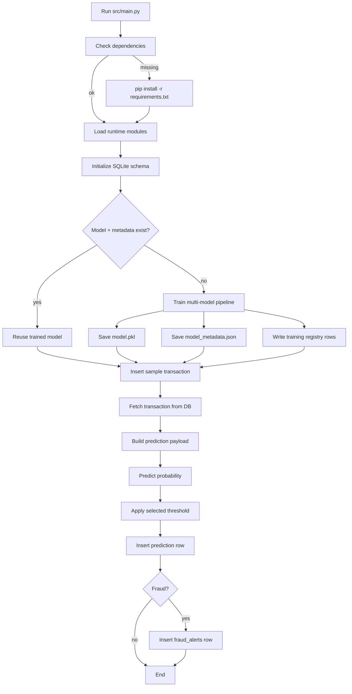

# System Working Overview

## 1. What This System Is

This project is a combined Database Systems and AI application for credit card fraud detection.

It has three main responsibilities:

1. Keep structured transaction and fraud data in SQLite.
2. Train and evaluate multiple machine learning models for fraud detection.
3. Run an end-to-end workflow from a single entrypoint: `src/main.py`.

The system is designed so a fresh clone can start from `main.py` and the application will:

- check whether required Python packages exist,
- install them from `requirements.txt` if needed,
- initialize the database,
- train a model if no valid model metadata exists,
- run fraud prediction on a sample transaction,
- store the prediction in the database,
- create a fraud alert when appropriate.

That means the project is not just a model script and not just a database script. It is a workflow-based system where the database and AI parts continuously feed into each other.

## 2. High-Level Flow

The flow is:

1. User runs `python src/main.py`.
2. `main.py` checks dependencies and installs missing ones.
3. `main.py` loads runtime modules only after the environment is ready.
4. SQLite database tables are created if they do not already exist.
5. The system checks whether a trained model and its metadata exist.
6. If not, training starts automatically.
7. A sample transaction is inserted into the database.
8. The inserted transaction is fetched back from SQLite.
9. The transaction is passed into the trained model.
10. The model produces a fraud probability.
11. The result is converted into a final fraud prediction using the selected threshold.
12. The prediction is stored in the database.
13. If fraud is predicted, a fraud alert is created.
14. The system prints the run summary.

## 3. Startup From `main.py`

`src/main.py` is the orchestration layer. It is the file that connects everything.

### 3.1 Dependency bootstrap

Before importing the full runtime stack, `main.py` checks whether the required packages are available:

- `pandas`
- `numpy`
- `sklearn`
- `joblib`
- `kagglehub`

If one or more are missing, the script runs:

```bash
python -m pip install -r requirements.txt
```

This makes the project more practical for a fresh clone because the user does not need to manually install dependencies first.

### 3.2 Lazy runtime imports

After the environment is ready, `main.py` imports the modules it needs:

- `src.db` for database operations
- `src.insert_data` for inserting a sample transaction
- `src.predict` for inference
- `model.train_model` for training when needed

This lazy loading matters because it prevents early failure if packages are missing or the environment is incomplete.

### 3.3 Model availability check

The workflow then checks whether a valid trained model is available.

The system uses two artifacts:

- `model/model.pkl` for the saved model pipeline
- `model/model_metadata.json` for threshold, model selection, and training details

If either the model file or metadata is missing, the system retrains.

This is important because the model artifact alone is not enough for the advanced pipeline. The prediction threshold and model-choice details are part of the final trained state.

## 4. Database Initialization

The database is created and initialized through `src.db.initialize_database()`.

The schema comes from `database/schema.sql`.

### 4.1 Core runtime tables

The runtime workflow uses these tables:

- `users`: stores cardholder identity data
- `transactions`: stores demo transactions used by the workflow
- `predictions`: stores model predictions and probabilities
- `fraud_alerts`: stores alerts when a transaction is predicted as fraud

### 4.2 Kaggle training table

The project also stores the downloaded Kaggle data in:

- `kaggle_transactions`

This is the table used for DB-first training from the imported Kaggle CSV.

### 4.3 Model registry tables

To make the project more advanced and academically strong, the database also stores model lifecycle data:

- `model_training_runs`
- `model_candidate_metrics`

These tables record:

- which dataset was used,
- which model was selected,
- the decision threshold,
- train/validation/test counts,
- F1 and average precision values,
- overfit and underfit flags,
- per-model candidate metrics.

That gives the project a real model audit trail instead of only a single saved pickle file.

## 5. Data Ingestion Path

The system has a separate path for bringing in the real Kaggle fraud dataset.

### 5.1 Download step

`src/download_dataset.py` uses `kagglehub` to download the dataset:

- dataset name: `mlg-ulb/creditcardfraud`
- output file: `creditcard.csv`
- local destination: `data/raw/creditcardfraud/creditcard.csv`

### 5.2 Import step

`src/import_kaggle_to_db.py` reads the CSV, validates its required columns, and inserts the records into `kaggle_transactions` in batches.

This import script does not drive the runtime prediction flow directly. Instead, it feeds the training layer.

That separation is useful because:

- the raw Kaggle data is kept intact,
- the runtime transaction workflow remains simple,
- the training pipeline can use the imported data as its source of truth.

## 6. Training Workflow in Detail

The training logic lives in `model/train_model.py`.

This is where the AI side becomes more advanced.

### 6.1 Data source priority

The trainer checks data sources in this order:

1. `kaggle_transactions` in SQLite
2. `data/fraud_transactions.csv`
3. synthetic fallback data generated in code

That means the system becomes data-driven if real data is available, but it still remains runnable if the real dataset is absent.

### 6.2 Schema mapping for training

The Kaggle credit card dataset has features like:

- `Time`
- `Amount`
- `V1` through `V28`
- `Class`

The current project runtime uses a different transaction schema with:

- `amount`
- `time`
- `location`
- `merchant`
- `fraud`

To bridge that gap, the trainer maps Kaggle features into the project schema for the runtime model pipeline.

That mapping is a design choice that keeps the runtime demo coherent while still letting the project use the real Kaggle dataset.

### 6.3 Candidate model comparison

The training pipeline compares three sklearn models:

- `LogisticRegression`
- `RandomForestClassifier`
- `ExtraTreesClassifier`

Each model gets the same preprocessing pipeline:

- numeric imputation
- scaling
- categorical imputation
- one-hot encoding

The comparison is not a simple train-once process. The system scores each candidate on validation data and selects the strongest one.

### 6.4 Split strategy

The data is split into three parts:

- training set
- validation set
- test set

This matters because the system does not choose a model only by training performance. It uses validation performance to select the winner, then evaluates the final model on a held-out test set.

### 6.5 Threshold tuning

Fraud detection is usually not best with a fixed threshold of 0.5.

The training pipeline computes precision-recall values and chooses a decision threshold that better matches the validation data.

This is more realistic for fraud work because:

- fraud classes are often imbalanced,
- recall is usually important,
- a threshold can trade precision for better fraud capture.

### 6.6 Overfit and underfit checks

The system also performs automatic fit checks.

It estimates:

- overfit risk by comparing train and validation performance gaps,
- underfit risk by checking whether the model is weak on both validation F1 and average precision.

These checks are not perfect theory-proof diagnostics, but they are a strong academic feature because they show the system is monitoring model quality rather than just printing a score.

### 6.7 Model persistence

When training finishes, the system saves:

- the selected pipeline to `model/model.pkl`
- training metadata to `model/model_metadata.json`
- training run history to SQLite tables

That means the model is not just stored as a file; it is also traceable and explainable.

## 7. Prediction Workflow in Detail

The inference path lives in `src/predict.py` and is used by `src/main.py`.

### 7.1 Loading the model

The system loads `model/model.pkl`.

### 7.2 Loading metadata

It also loads `model/model_metadata.json` when available.

This is important because the threshold used for prediction is not always 0.5.

### 7.3 Probability to class conversion

The model produces a fraud probability.

Then the system converts that probability into a final class using the stored threshold.

So the prediction step is:

- model probability output
- compare against selected threshold
- class 1 means fraud
- class 0 means non-fraud

### 7.4 Why this matters

This is a stronger design than a fixed hard-coded threshold because the selected threshold comes from the validation stage and matches the chosen model’s behavior.

## 8. Runtime Transaction Workflow

The runtime workflow in `src.main` is the demo transaction pipeline.

### 8.1 Insert a sample transaction

The project inserts a deterministic sample transaction using `src.insert_data.insert_sample_transaction()`.

This is a simple way to demonstrate the database layer without requiring a user to manually type transaction data.

### 8.2 Fetch the same transaction

After insertion, the system fetches the transaction back from the database.

This may look redundant, but it is a deliberate database systems design choice.

It shows:

- the row was actually stored,
- foreign key relationships are respected,
- the application can read its own persisted data before model inference.

### 8.3 Build the prediction payload

The fetched database row is converted into a model input payload.

Then the system calls the prediction layer.

### 8.4 Store prediction results

The result is inserted into the `predictions` table.

That means inference is part of the database workflow, not a separate isolated computation.

### 8.5 Create alert when fraud is detected

If the prediction is fraud, the system inserts a row in `fraud_alerts`.

This closes the loop from data entry to model output to actionable alert.

## 9. How the Database and AI Actually Connect

The database and AI components are linked in multiple places:

1. The database stores the input transactions.
2. The database stores imported training data from Kaggle.
3. The trainer reads from SQLite when available.
4. The trainer stores model run metadata back into SQLite.
5. The predictor reads model metadata to use the right threshold.
6. The runtime workflow stores predictions and fraud alerts back into SQLite.

This makes the project feel like a real system rather than a one-off ML notebook.

## 10. Why This Is More Advanced Now

Compared with a simple demo script, this project now demonstrates:

- database initialization and persistence,
- normalized runtime transaction storage,
- imported external data loading,
- multi-model selection,
- threshold tuning,
- model quality checks,
- model registry tables,
- prediction logging,
- fraud alert creation,
- a single bootstrapped entrypoint.

That is a much better fit for a DBS + AI course project.

## 11. Step-by-Step Execution Summary

If someone runs `python src/main.py`, the sequence is:

1. Check installed packages.
2. Install missing packages if needed.
3. Load the app modules.
4. Initialize SQLite tables.
5. Check if a valid model and metadata exist.
6. Train or retrain if needed.
7. Insert a sample transaction.
8. Read the row back from the database.
9. Build the model input payload.
10. Predict fraud probability.
11. Convert probability into a class using the selected threshold.
12. Store the prediction.
13. Create an alert if the transaction is fraudulent.
14. Print the summary.

## 12. Mermaid View



## 13. What To Say In a Viva or Report

A simple way to describe the project is:

> This system connects a relational database with an AI fraud detection pipeline. The database stores both runtime transactions and training data, while the AI layer compares multiple models, selects the best one using validation metrics, tunes the threshold, and logs the training run back into the database. The whole application starts from a single entrypoint, which makes the system reproducible and easy to run.

## 14. Future Improvements

If you want to make it even stronger later, the next logical steps are:

- normalize merchant and location values into lookup tables,
- add cross-validation reporting,
- add SHAP or feature-importance explanations,
- add a review/feedback loop for alerts,
- add a separate native Kaggle feature benchmark model.

