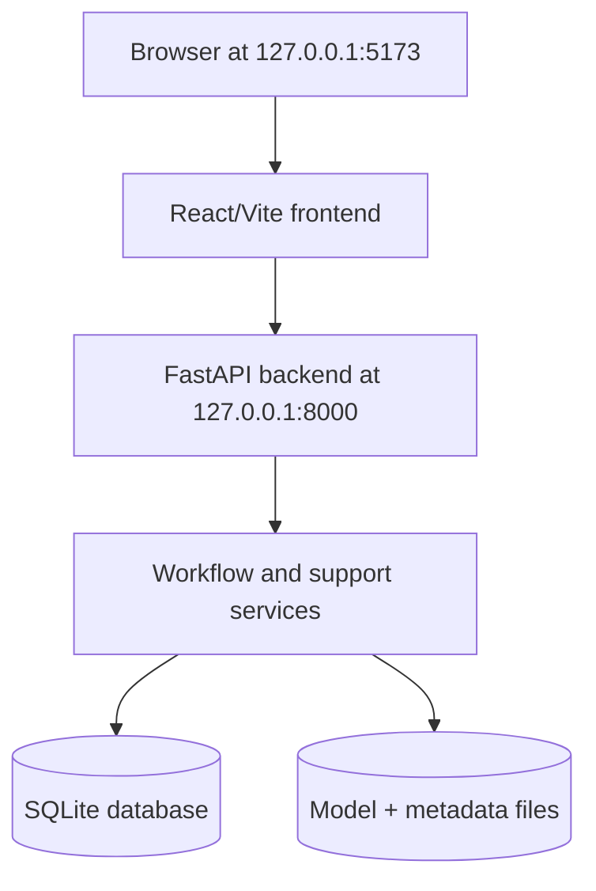
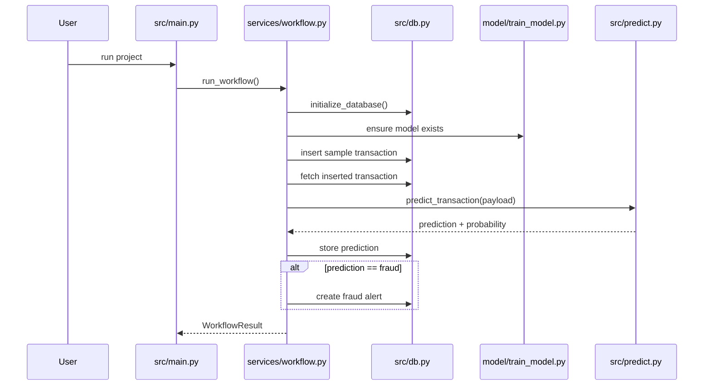
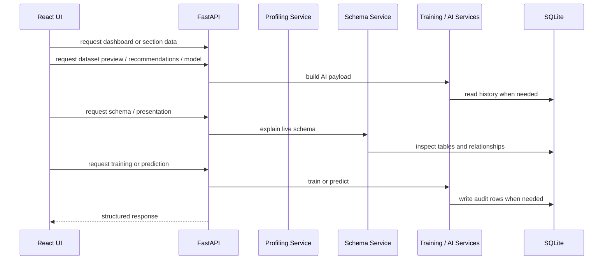

# Current System Deep Dive

## 1. Purpose of This Document

This file explains the repository as it actually exists today, not as it originally started.

It is written for three academic angles:

1. **DBS**: database structure, normalization, and schema explanation
2. **AI**: data profiling, model recommendation, training, metrics, and prediction
3. **SDA**: architecture, layers, flows, API, frontend, and presentation readiness

This document is intentionally practical. It describes the current code, current modules, current data flow, current database design, current UI behavior, current strengths, and current limitations.

## 2. One-Line Summary

The current project is a **local fraud-detection platform** that combines:

- SQLite persistence,
- dataset profiling,
- live schema explanation,
- rule-based model recommendation,
- shortlist-based model training,
- fraud prediction and alert logging,
- FastAPI endpoints,
- a React presentation dashboard with offline fallback mode.

## 3. Repository Reality Check

The repository is broader than the older backend-only version. Its real structure now includes:

```text
database/
  schema.sql
data/
  fraud_detection.db
  samples/
    sample_profile_dataset.csv
  uploads/
frontend/
  src/
    App.jsx
    demoData.js
    components/MermaidDiagram.jsx
model/
  train_model.py
  model.pkl
  model_metadata.json
src/
  api/
    app.py
  core/
    config.py
    console.py
  services/
    ai_demo.py
    dataset_profiling.py
    model_recommendation.py
    presentation_support.py
    schema_explainer.py
    workflow.py
  db.py
  download_dataset.py
  explain_database.py
  import_kaggle_to_db.py
  insert_data.py
  main.py
  predict.py
  profile_dataset.py
  recommend_models.py
  run_api.py
README.md
SYSTEM_WORKING.md
report.md
SRS.md
currentsys.md
proposal.pdf
```

Important correction:

- this is now **both** a backend project **and** a frontend presentation project,
- the current codebase includes API and UI layers,
- the current system also includes profiling, schema explanation, recommendation, and presentation-support features.

## 4. Verified Current Local State

The local environment currently shows:

- `data/fraud_detection.db` exists
- `model/model.pkl` exists
- `model/model_metadata.json` exists
- `data/samples/sample_profile_dataset.csv` exists
- `frontend/dist/index.html` exists
- `data/raw/creditcardfraud/creditcard.csv` does **not** currently exist locally

Current database row counts:

- `users`: 1
- `transactions`: 22
- `predictions`: 22
- `fraud_alerts`: 22
- `kaggle_transactions`: 0
- `raw_dataset_uploads`: 7
- `dataset_profiles`: 7
- `feature_profiles`: 70
- `model_training_runs`: 10
- `model_recommendations`: 18
- `model_candidate_metrics`: 30

Current saved model metadata says:

- dataset source: `synthetic:generated`
- selected model: `logistic_regression`
- selection metric: `validation_average_precision`
- selected threshold: `0.6762725380991143`
- shortlisted models in metadata: `3`
- full model pool in metadata: `10`
- validation F1: `0.6336633663366337`
- test F1: `0.48484848484848486`

Important conclusion:

The code fully supports profiling, recommendation, training, API usage, and presentation, but the current local model is still trained from synthetic fallback data because Kaggle rows are not currently loaded into SQLite and the Kaggle CSV is not present locally.

## 5. What the System Does Today

### 5.1 In simple words

If a non-technical person asks what the project does, the honest answer is:

> It helps explain fraud-related data, trains a fraud model, stores all important results in a database, predicts whether a transaction looks suspicious, raises an alert when needed, and presents the whole workflow in a clear academic dashboard.

### 5.2 In technical words

The current system combines:

- a relational SQLite schema,
- a scikit-learn training and inference pipeline,
- dataset profiling and explanation services,
- a model-shortlisting engine,
- a FastAPI backend,
- a React/Vite frontend with Mermaid diagram rendering,
- presentation-support content for AI, DBS, and SDA discussion.

## 6. Current Architecture

## 6.1 Layered design

The codebase now follows a five-layer structure:

1. **Frontend presentation layer**
   - `frontend/src/App.jsx`
   - `frontend/src/demoData.js`
   - `frontend/src/components/MermaidDiagram.jsx`

2. **API layer**
   - `src/api/app.py`

3. **Service layer**
   - `src/services/workflow.py`
   - `src/services/dataset_profiling.py`
   - `src/services/schema_explainer.py`
   - `src/services/model_recommendation.py`
   - `src/services/ai_demo.py`
   - `src/services/presentation_support.py`

4. **Persistence layer**
   - `src/db.py`
   - `database/schema.sql`

5. **Model and artifact layer**
   - `model/train_model.py`
   - `src/predict.py`
   - `model/model.pkl`
   - `model/model_metadata.json`

## 6.2 High-level local deployment view



## 6.3 Major operating modes

The project now works in three main modes:

1. **CLI workflow mode** through `src/main.py`
2. **Live backend + frontend mode** through FastAPI and React
3. **Offline presentation mode** in the frontend when the backend is unavailable

That third mode is an important practical feature for demos.

## 7. File-by-File Deep Dive

## 7.1 `src/main.py`

This is still the CLI entrypoint for the traditional end-to-end workflow.

Responsibilities:

- detect missing dependencies,
- install requirements if needed,
- run the workflow service,
- print training summary and workflow summary.

Important update:

`main.py` is no longer the whole story. It is now one entrypoint among several. The live system can also be used through FastAPI and the frontend.

## 7.2 `src/services/workflow.py`

This is the real orchestration layer for the CLI and API workflow path.

Responsibilities:

- initialize the database,
- ensure the model exists or retrain if required,
- insert the sample transaction,
- fetch it back,
- call prediction,
- store prediction,
- create fraud alert if prediction is fraud,
- return a structured `WorkflowResult`.

This is a clean separation because `main.py` prints results, while `workflow.py` performs the business flow.

## 7.3 `src/db.py`

This is the central data-access module.

Responsibilities:

- open SQLite connections,
- enable foreign keys,
- initialize schema,
- insert Kaggle rows,
- insert training runs,
- insert recommendations,
- insert dataset profile records,
- insert feature profiles,
- insert and fetch runtime transaction records,
- store predictions and fraud alerts,
- inspect schema tables, columns, foreign keys, and indexes.

Key pattern:

This file is now much more than a simple DB helper. It acts like the system's persistence gateway.

## 7.4 `model/train_model.py`

This is the most important AI module.

Responsibilities:

- load the best available dataset source,
- map Kaggle data into project-level features,
- generate synthetic fallback data if needed,
- build the shared preprocessing pipeline,
- score a 10-model pool through the recommendation service,
- train the shortlisted 3 candidates,
- tune thresholds,
- compute train, validation, and test metrics,
- select the final winner,
- save model artifact and metadata,
- persist training history to SQLite.

Important reality:

The current code no longer trains just one Random Forest. It uses a shortlist-based selection process and can still choose Logistic Regression as the winner.

## 7.5 `src/predict.py`

This is the inference layer.

Responsibilities:

- load `model/model.pkl`,
- load `model/model_metadata.json`,
- read the saved threshold,
- compute probability,
- convert probability into class.

The saved threshold is a key design feature because fraud classification often needs a threshold different from `0.5`.

## 7.6 `src/services/model_recommendation.py`

This is one of the major new modules compared with the older system.

Responsibilities:

- inspect dataset characteristics,
- score candidate models based on data shape and imbalance,
- rank the full pool,
- produce the shortlist of 3 models,
- attach rationale text to each recommendation.

Important detail:

The recommendation logic is rule-based, not learned from meta-data. That is acceptable for an academic shortlist engine as long as it is described honestly.

## 7.7 `src/services/dataset_profiling.py`

This is the dataset-understanding layer.

Responsibilities:

- load a CSV dataset,
- detect candidate target columns,
- infer role and simplified data type for each column,
- calculate duplicates and missingness,
- calculate class distribution and imbalance ratio,
- generate simple and technical descriptions,
- persist upload, dataset, and feature-level results.

This module gives the project a true "understand the dataset first" story.

## 7.8 `src/services/schema_explainer.py`

This module turns the live schema into explanation content.

Responsibilities:

- inspect tables from SQLite,
- explain columns,
- explain foreign keys,
- group tables by layer,
- produce normalization summary,
- generate Mermaid ER text.

This is especially valuable for the DBS viva because the ER and normalization explanation are now generated from the actual database.

## 7.9 `src/services/ai_demo.py`

This service powers the AI tab.

Responsibilities:

- show dataset preview,
- provide manual input options,
- build risk-signal explanations,
- calculate confidence bands,
- predict held-out test samples for demo.

This is one of the modules that makes the system presentation-friendly rather than script-only.

## 7.10 `src/services/presentation_support.py`

This module prepares presentation-specific content.

Responsibilities:

- build diagram packs,
- build readiness checks,
- build report sections,
- build viva notes,
- export payloads as Markdown or JSON.

This is effectively the "academic explanation engine" for the project.

## 7.11 `src/api/app.py`

This is the FastAPI application.

Responsibilities:

- initialize the database on startup,
- expose dataset, profiling, schema, AI, model, and workflow endpoints,
- serialize dataclasses and paths,
- support CORS for the local frontend.

This file is the bridge between backend logic and frontend consumption.

## 7.12 `frontend/src/App.jsx`

This is the presentation frontend.

Responsibilities:

- manage section tabs for AI, DB, and SDA,
- call backend endpoints,
- show dataset cards, metrics, and tables,
- render model shortlist and metrics,
- provide manual prediction form,
- display ER and architecture diagrams,
- switch to offline mode when backend health fails.

Important conclusion:

The project now absolutely includes a frontend and should be described that way.

## 7.13 `frontend/src/components/MermaidDiagram.jsx`

This component handles live diagram rendering in the browser.

Responsibilities:

- lazy-load Mermaid,
- sanitize rendering through DOMPurify,
- cache rendered diagrams,
- show graceful fallback content when rendering fails.

This is a good small example of clean frontend isolation.

## 8. Database Design Deep Dive

## 8.1 Schema layers

The live schema currently contains four layers:

### Raw training layer

- `kaggle_transactions`

Purpose:

- preserve imported Kaggle training rows in a wide raw structure

### Raw profiling layer

- `raw_dataset_uploads`

Purpose:

- register datasets that were selected or uploaded for profiling

### Operational layer

- `users`
- `transactions`
- `predictions`
- `fraud_alerts`

Purpose:

- run the sample transaction workflow and store runtime outcomes

### Analytics and audit layer

- `dataset_profiles`
- `feature_profiles`
- `model_training_runs`
- `model_recommendations`
- `model_candidate_metrics`

Purpose:

- preserve dataset understanding and model history for later explanation

## 8.2 Core operational tables

### `users`

- stores cardholder identity
- unique constraints on `email` and `card_number`

### `transactions`

- stores transaction facts
- includes `amount`, `time`, `location`, `merchant`
- links to `users`

### `predictions`

- stores model output for each transaction
- includes `prediction` and `probability`
- links to `transactions`

### `fraud_alerts`

- stores alert rows for suspicious transactions
- includes `alert_time` and `status`
- links to `transactions`

## 8.3 Profiling tables

### `raw_dataset_uploads`

- one row per profiled dataset file
- stores filename, source path, size, row count, and target column

### `dataset_profiles`

- dataset-level summary row
- stores duplicates, missing cells, type counts, imbalance ratio, and warnings JSON

### `feature_profiles`

- one row per column per profile
- stores role, inferred dtype, sample values, numeric stats, and natural-language descriptions

## 8.4 Model audit tables

### `model_training_runs`

- one row per training session
- stores selected model, threshold, counts, F1 values, AP values, flags, timestamps, and notes

### `model_recommendations`

- stores the shortlist created before training
- captures recommendation rank, rationale, and whether the row became the final winner

### `model_candidate_metrics`

- stores detailed validation/train metrics for compared candidates
- preserves one-to-many comparison history for each run

## 8.5 Constraints and integrity rules

The schema includes:

- primary keys on all application tables,
- foreign keys for parent-child relations,
- `ON DELETE CASCADE` on child tables,
- check constraints on:
  - amount values,
  - hour range,
  - binary predictions,
  - probability range,
  - alert status values,
  - Kaggle class labels,
  - recommendation rank positivity,
  - shortlist and audit flags.

## 8.6 Indexes

The schema indexes the key lookup paths, including:

- transaction parent links,
- prediction parent links,
- alert parent links,
- Kaggle label/source filters,
- training-run source/model filters,
- run-level audit tables,
- profiling upload/profile lookups.

## 8.7 Normalization analysis

### What is normalized well

- user identity is separated from transactions
- predictions are separated from transactions
- alerts are separated from transactions and predictions
- profiling summary is separated from file registration and feature detail
- training runs are separated from recommendations and candidate metrics

### What is intentionally denormalized

- `kaggle_transactions` is wide by design because it preserves source training rows

### What is still simplified

- `location` and `merchant` remain text fields in `transactions`

Best honest verdict:

> The operational part is mostly close to 3NF for the current project scope, but some descriptive fields remain simplified for implementation practicality.

## 9. AI Pipeline Deep Dive

## 9.1 Final project feature schema

The runtime model uses:

- `amount`
- `time`
- `location`
- `merchant`

Target:

- `fraud`

This is important because the system does not use all Kaggle `V1..V28` values directly at runtime.

## 9.2 Data source priority

The exact fallback order is:

1. `kaggle_transactions` in SQLite
2. `data/fraud_transactions.csv`
3. synthetic generated dataset

Current local result:

- the latest saved model came from synthetic fallback data

## 9.3 Synthetic dataset strategy

When real data is unavailable, the project generates synthetic rows using:

- gamma-like transaction amounts,
- random hours,
- categorical location and merchant values,
- a rule-based fraud score with random noise.

This keeps the project runnable, but it must be presented honestly as fallback data rather than real production data.

## 9.4 Kaggle-to-project mapping

The code maps Kaggle values into the smaller project schema:

- `amount` from Kaggle `Amount`
- `time` from `time_seconds` converted into hour-of-day
- `location` from a heuristic score based on `v1`, `v2`, and `v3`
- `merchant` from a heuristic score based on `v4` and `v5`
- `fraud` from `class_label`

Academic honesty point:

This mapping is artificial. It is not a true semantic recovery of anonymized PCA features. It exists to keep the project-level runtime schema simple and explainable.

## 9.5 Preprocessing pipeline

Numeric features:

- `amount`
- `time`

Processing:

- median imputation
- standard scaling

Categorical features:

- `location`
- `merchant`

Processing:

- most-frequent imputation
- one-hot encoding

This is implemented through a shared scikit-learn `ColumnTransformer` and `Pipeline`.

## 9.6 Candidate model pool

The full recommendation pool now contains 10 models:

- logistic regression
- decision tree
- random forest
- extra trees
- gradient boosting
- hist gradient boosting
- adaboost
- svm
- knn
- naive bayes

The recommendation engine chooses the top 3 for actual training.

## 9.7 Current shortlist behavior

The metadata currently shows the shortlist:

1. `logistic_regression`
2. `random_forest`
3. `extra_trees`

This means the project now does something stronger than "always train one model."

## 9.8 Split strategy

The pipeline uses:

- 80% train+validation / 20% test
- then 75% / 25% inside train+validation

Effective ratio:

- 60% train
- 20% validation
- 20% test

## 9.9 Threshold tuning

The code does not hardcode `0.5`.

Instead it:

- computes the precision-recall curve on validation probabilities,
- calculates F1 across thresholds,
- chooses the threshold with the best validation F1.

This is a meaningful fraud-detection design choice because class imbalance matters.

## 9.10 Winner selection logic

The best shortlisted model is selected by:

1. validation average precision
2. validation F1
3. validation recall

This is a defensible ranking order for imbalanced classification.

## 9.11 Overfit and underfit checks

The code flags overfit if the train/validation gap is too large.

The code flags underfit if both validation F1 and validation average precision are weak.

These are heuristic quality checks, not formal guarantees, but they are useful for academic explanation.

## 9.12 Persistence and audit trail

The training layer saves:

- `model/model.pkl`
- `model/model_metadata.json`
- `model_training_runs`
- `model_recommendations`
- `model_candidate_metrics`

This is one of the strongest engineering features in the current project.

## 10. API Deep Dive

The FastAPI app exposes several groups of endpoints.

## 10.1 Health and dashboard

- `GET /api/health`
- `GET /api/dashboard`

These support frontend connectivity checks and summary counts.

## 10.2 Dataset and profiling

- `GET /api/datasets/options`
- `GET /api/profiles/latest`
- `POST /api/profile/path`
- `POST /api/profile/upload`

These support dataset selection, upload, profiling, and result retrieval.

## 10.3 Schema and presentation

- `GET /api/schema`
- `GET /api/presentation`
- `GET /api/presentation/export`

These support DBS explanation and SDA presentation output.

## 10.4 AI and model operations

- `GET /api/recommendations/current`
- `GET /api/ai/dataset-preview`
- `POST /api/predict/manual`
- `GET /api/predict/test-sample`
- `GET /api/model/latest`
- `POST /api/train`
- `POST /api/workflow/run`

This group powers the AI tab and live backend actions.

## 11. Frontend Deep Dive

## 11.1 Main UI idea

The frontend is not a generic app shell. It is a presentation interface structured around three academic tabs:

- AI
- DB
- SDA

That is an intentional design decision because the project must be presented across three subjects.

## 11.2 AI tab behavior

The AI tab does these jobs:

- display dataset preview,
- display dataset characteristics used for shortlist scoring,
- show shortlisted and full model pool views,
- show selected model story,
- trigger training,
- run manual prediction,
- run held-out sample prediction.

## 11.3 DB tab behavior

The DB tab does these jobs:

- show latest profiled dataset summary,
- show raw columns and sample values,
- group tables by layer,
- explain normalization,
- display ER diagram and key relationship talking points.

## 11.4 SDA tab behavior

The SDA tab does these jobs:

- show introduction and problem statement,
- show methodology and architecture,
- show functional/non-functional requirements,
- show testing cases,
- show architecture and state-related diagrams.

## 11.5 Offline mode

When `/api/health` fails:

- AI and DB content switch to demo snapshots,
- live training is disabled,
- manual prediction uses offline demo logic,
- the user sees an offline presentation notice,
- SDA content remains usable.

This is a very practical feature for academic presentation reliability.

## 12. Runtime Flow Deep Dive

## 12.1 CLI workflow sequence



## 12.2 Frontend live sequence



## 13. Software Engineering and SDA View

## 13.1 Strong architectural patterns present today

- layered responsibilities
- orchestration separated from execution
- data access centralized in one module
- model artifact plus metadata persistence
- audit tables for training history
- fallback strategy for missing data
- frontend offline resilience
- dedicated presentation-support module

## 13.2 What the SDA instructor can appreciate now

Compared with the older version, the current repository now clearly demonstrates:

- frontend layer,
- backend API layer,
- service layer,
- persistence layer,
- model layer,
- reusable configuration,
- academic diagram generation,
- testing/verification scripts for project phases.

## 13.3 What is still missing for a stronger software-engineering story

- authentication and roles
- production deployment pipeline
- automated unit/integration test suite beyond verification scripts
- logging framework beyond console and UI feedback
- user-driven runtime transaction capture instead of demo-only insertion

## 14. Patterns, Strengths, and Weaknesses

## 14.1 Strong patterns

- clear schema ownership in one SQL file
- strong use of scikit-learn pipelines
- shortlist-before-train design
- training decision traceability
- profiling and schema explanation integrated into the same system
- frontend designed around academic storytelling

## 14.2 Current limitations

- still local-only
- still presentation-oriented rather than production-oriented
- current saved model is synthetic-data-based
- heuristic Kaggle mapping is not semantically real
- some backend features are not directly exposed in the frontend
- runtime transaction path is still deterministic and demo-driven

## 14.3 Important honesty point

For a viva, do **not** claim:

- this is a production fraud engine,
- the Kaggle mapping is real semantic enrichment,
- the current local model is trained on imported Kaggle rows,
- the frontend supports every backend action.

Do claim:

- the system is modular,
- the data and model history are auditable,
- the schema explanation is live,
- the project intentionally connects AI, DBS, and SDA in one runnable platform.

## 15. What Each Instructor Can Be Told Today

## 15.1 For the DBS instructor

You can say:

> The project uses a layered SQLite schema with operational, raw, and analytics tables. It separates runtime transactions from predictions and alerts, separates dataset file registration from profiling detail, and separates model-run summaries from shortlist and candidate-level metrics. The ER diagram and normalization story are generated from the live schema.

## 15.2 For the AI instructor

You can say:

> The AI pipeline first profiles the data characteristics, scores a 10-model pool, trains the top 3 shortlisted candidates, tunes the decision threshold on validation probabilities, selects the winner by validation average precision, and stores the model plus audit history for later explanation.

## 15.3 For the SDA instructor

You can say:

> The system now has a real layered architecture with React frontend, FastAPI backend, service modules, SQLite persistence, and scikit-learn model artifacts. It also includes presentation support, Mermaid diagrams, offline fallback mode, and verification scripts to support structured explanation of the software design.

## 16. Honest Final Assessment

This repository is now much stronger than the earlier backend-only demo. It already proves:

- database and AI integration,
- dataset understanding and explanation,
- shortlist-based model training,
- persistent audit history,
- API-backed presentation flow,
- frontend support for AI, DB, and SDA discussion.

It is still not a production system, but it is now a solid academic platform for a semester project and is strong enough to be documented through an SRS, report, system working overview, and proposal.
